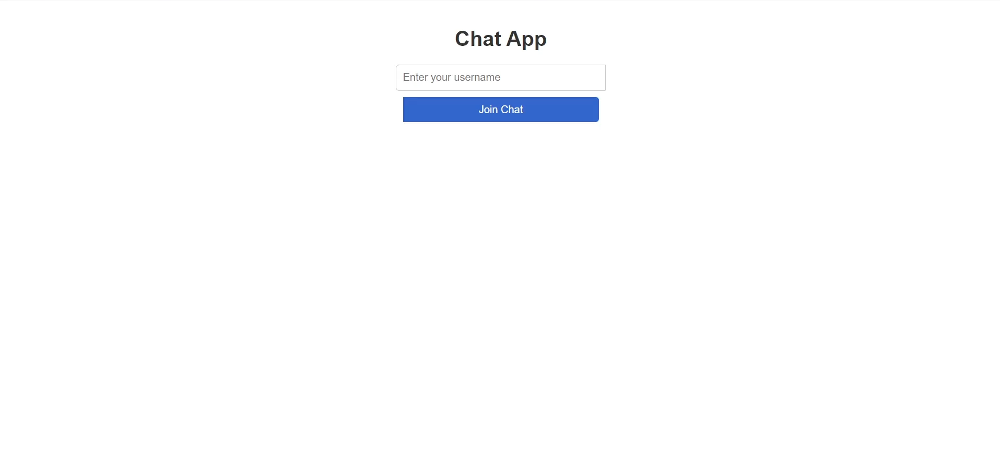
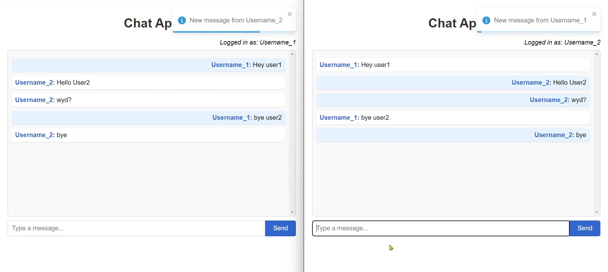
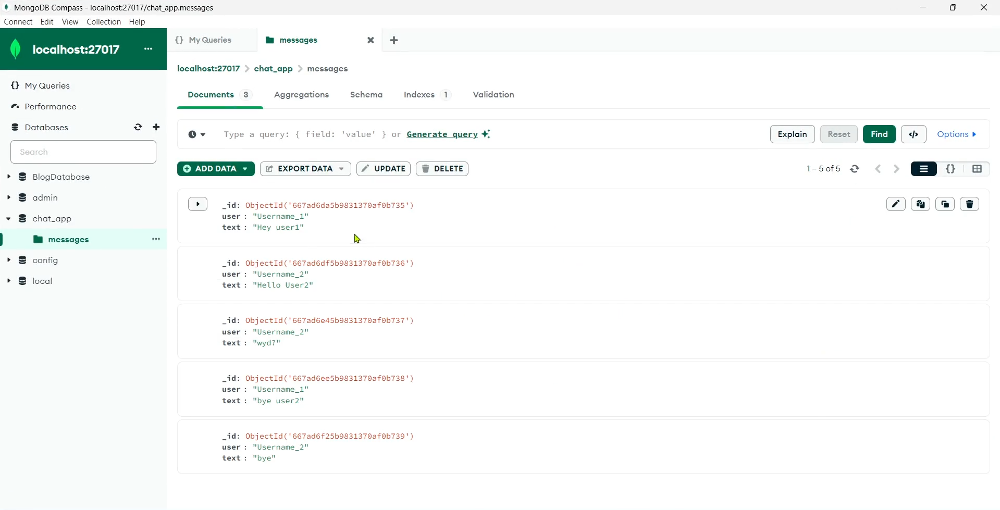

# FastAPI ChatApp Documentation

## Table of Contents

1. [Introduction](#introduction)
2. [Project Structure](#project-structure)
3. [Prerequisites](#prerequisites)
4. [Installation](#installation)
5. [Usage](#usage)
6. [Features](#features)
7. [Code Overview](#code-overview)
   - [Backend (FastAPI)](#backend-fastapi)
   - [Frontend (React)](#frontend-react)
8. [API Documentation](#api-documentation)
9. [WebSocket Protocol](#websocket-protocol)
10. [Database Schema](#database-schema)
11. [Deployment Guide](#deployment-guide)
12. [Troubleshooting](#troubleshooting)
13. [Future Enhancements](#future-enhancements)
14. [Contributing](#contributing)
15. [License](#license)

## Introduction

FastAPI ChatApp is a real-time chat application built using the FARM stack (FastAPI, React, MongoDB). This project demonstrates how to create a simple yet functional chat system with real-time messaging capabilities using WebSockets.

Key features:
- Real-time messaging
- User authentication (username-based)
- Message persistence using MongoDB
- Responsive UI


## Project Structure

The project is divided into two main parts:
- **Backend**: FastAPI server
- **Frontend**: React application

```bash
FastAPI_ChatApp/
│
├── app/
│   └── main.py
│
├── chat-app/
│   ├── public/
│   ├── src/
│   │   ├── App.js
│   │   └── App.css
│   ├── package.json
│   └── README.md
│
└── README.md
```

## Prerequisites

Before you begin, ensure you have the following installed:
- Python 3.7+
- Node.js and npm
- MongoDB

## Installation

### Clone the Repository
```bash
git clone https://github.com/GruheshKurra/FastAPI_ChatApp.git
cd FastAPI_ChatApp
```
### Backend Setup

1. **Create a virtual environment (optional but recommended):**
```bash
python -m venv venv
source venv/bin/activate  # On Windows, use `venv\Scripts\activate`
```
2. **Install the required Python packages:**
```bash
pip install fastapi uvicorn pymongo pydantic
```
3. **Start the MongoDB server locally.**

4. **Run the FastAPI server:**
```bash
uvicorn app.main:app --reload
```
The backend server will start running on http://localhost:8000.

### Frontend Setup

1. **Navigate to the frontend directory:**
```bash
cd chat-app
```
2. **Install the required npm packages:**
```bash
npm install
```
3. **Start the React development server:**
```bash
$env:NODE_OPTIONS="--openssl-legacy-provider"
npm start
```
The frontend application will start running on http://localhost:3000.

## Usage

1. Open your web browser and go to http://localhost:3000.
2. Enter a username to join the chat.
3. Start sending and receiving messages in real-time.





## Features

- Real-time messaging using WebSockets
- User authentication (simple username-based)
- Persistent message storage using MongoDB
- Responsive UI design
- Toast notifications for connection status and new messages

## Code Overview

### Backend (FastAPI)

The backend is built using FastAPI and provides the following main components:

#### FastAPI Application Setup:
```bash
app = FastAPI()

app.add_middleware(
    CORSMiddleware,
    allow_origins=origins,
    allow_credentials=True,
    allow_methods=["*"],
    allow_headers=["*"],
)
```
#### MongoDB Connection:
```bash
client = MongoClient(os.getenv('MONGO_URI', 'mongodb://localhost:27017'))
db = client['chat_app']
messages_collection = db['messages']
```
#### Message Model:
```bash
class Message(BaseModel):
    user: str
    text: str
```
#### REST Endpoints:
```bash
@app.get("/messages")
async def get_messages():
    messages = list(messages_collection.find({}, {"_id": 0}))
    return messages

@app.post("/messages")
async def post_message(message: Message):
    messages_collection.insert_one(message.dict())
    return message
```
#### WebSocket Handling:
```bash
@app.websocket("/ws")
async def websocket_endpoint(websocket: WebSocket):
    await manager.connect(websocket)
    try:
        while True:
            data = await websocket.receive_text()
            message = Message(**eval(data))
            messages_collection.insert_one(message.dict())
            await manager.broadcast(data)
    except WebSocketDisconnect:
        manager.disconnect(websocket)
```
### Frontend (React)

The frontend is a single-page React application with the following main components:

#### State Management:
```bash
const [messages, setMessages] = useState([]);
const [input, setInput] = useState('');
const [user, setUser] = useState('');
const [usernameInput, setUsernameInput] = useState('');
const ws = useRef(null);
```
#### WebSocket Connection:
```bash
const connectWebSocket = () => {
  ws.current = new WebSocket('ws://localhost:8000/ws');
  
  ws.current.onopen = () => {
    console.log('WebSocket connected');
    toast.success('Connected to chat server');
  };
  
  ws.current.onmessage = (event) => {
    const newMessage = JSON.parse(event.data);
    setMessages((prevMessages) => [...prevMessages, newMessage]);
    
    if (newMessage.user !== user) {
      toast.info(`New message from ${newMessage.user}`);
    }
  };

  // ... error and close handlers
};
```
#### Sending Messages:
```bash
const sendMessage = () => {
  if (input.trim() && ws.current && ws.current.readyState === WebSocket.OPEN) {
    const message = { user, text: input };
    ws.current.send(JSON.stringify(message));
    setInput('');
  } else {
    toast.warn('Unable to send message. Please check your connection.');
  }
};
```
#### Rendering Messages:
```bash
<div className="chat-container">
  {messages.map((msg, index) => (
    <div key={index} className={`message ${msg.user === user ? 'own-message' : ''}`}>
      <strong>{msg.user}:</strong> {msg.text}
    </div>
  ))}
</div>
```
## API Documentation

### REST Endpoints

#### GET /messages
- **Description**: Retrieve all messages from the database
- **Response**: Array of Message objects

#### POST /messages
- **Description**: Add a new message to the database
- **Request Body**: Message object
- **Response**: Created Message object

### WebSocket Endpoint

- **URL**: ws://localhost:8000/ws
- **Protocol**: Messages are sent and received as JSON strings

## WebSocket Protocol

Messages are sent and received in the following format:
```json
{
  "user": "username",
  "text": "message content"
}
```
## Database Schema

The MongoDB database uses a single collection named `messages` with the following schema:
```json
{
  "user": String,
  "text": String
}
```
## Deployment Guide

For deploying to a production environment:
1. Set up a production-ready MongoDB instance.
2. Update the `MONGO_URI` environment variable with the production database URL.
3. Configure CORS settings in the FastAPI app for your production domain.
4. Build the React app for production:
```bash
cd chat-app
npm run build
```
5. Set up a reverse proxy (e.g., Nginx) to serve both the FastAPI backend and React frontend.
6. Ensure proper error handling and reconnection logic for WebSockets in a production environment.
7. Consider using environment variables for sensitive information and configuration.

## Troubleshooting

### Common issues and solutions:

#### WebSocket connection fails
- Ensure the backend server is running
- Check if the WebSocket URL is correct
- Verify that your network allows WebSocket connections

#### Messages not persisting
- Check MongoDB connection
- Ensure the correct database and collection names are used

#### CORS errors
- Verify the origins list in the backend includes your frontend URL

## Future Enhancements

Potential improvements for the project:
- Implement user authentication with passwords
- Add private messaging functionality
- Implement chat rooms or channels
- Add file sharing capabilities
- Improve error handling and connection recovery
- Implement message read receipts
- Add user profiles with avatars

## Contributing

Contributions to the FastAPI ChatApp are welcome! Please follow these steps:
1. Fork the repository
2. Create a new branch for your feature
3. Commit your changes
4. Push to your fork
5. Submit a pull request

Please ensure your code adheres to the project's coding standards and includes appropriate tests.
